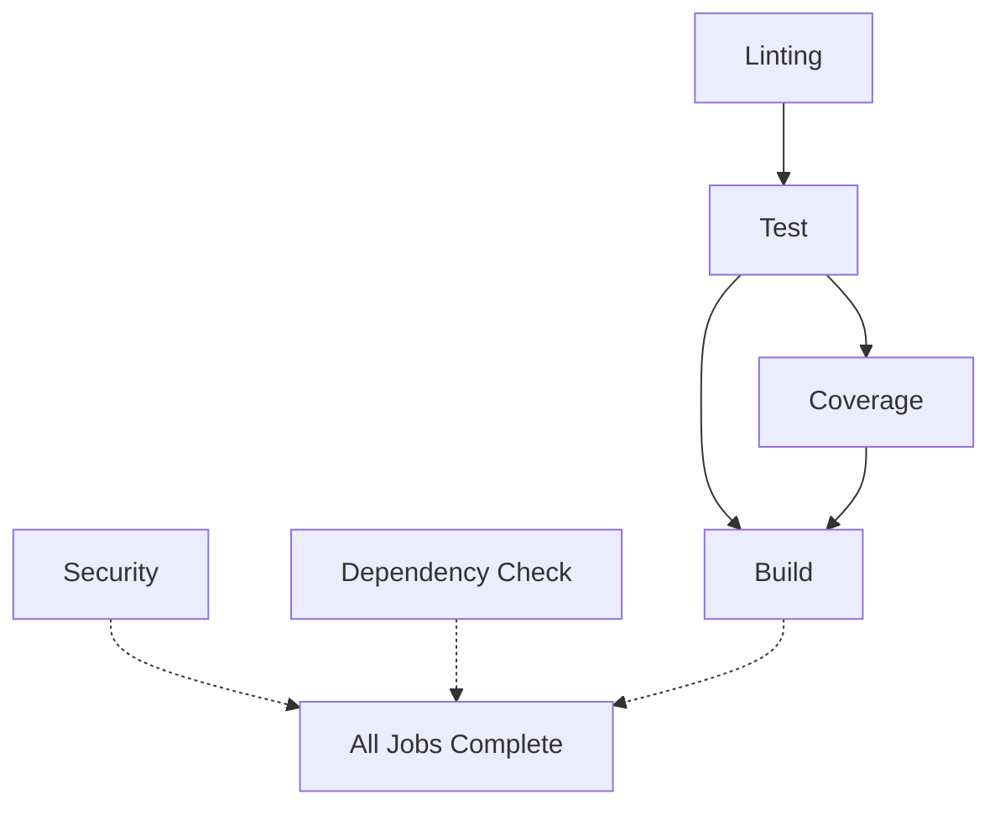

# Enhanced CI/CD Implementation Summary

## Date: October 8, 2025
## Status: ✅ Implemented

---

## What Was Implemented

This document describes the comprehensive CI/CD enhancement that adds **rich job summaries** to GitHub Actions, inspired by the `purposive-app` Ruby/Rails workflow.

### Files Created

1. **`.github/workflows/enhanced-ci.yml`** - Complete enhanced CI workflow
2. **`deny.toml`** - cargo-deny configuration (permissive)
3. **`.config/nextest.toml`** - cargo-nextest configuration
4. **`docs/ENHANCED_CI_IMPLEMENTATION.md`** - This documentation

---

## Configuration Decisions

Based on user confirmation:

| Decision | Choice | Rationale |
|----------|--------|-----------|
| **Test Runner** | `cargo-nextest` | Faster execution, better JSON output |
| **Coverage Threshold** | 28% | Keep current baseline, increase later |
| **Security Policy** | Warn only | Non-blocking for vulnerabilities |
| **License Policy** | Permissive | Allow common OSS licenses, warn on copyleft |
| **Implementation** | All at once | Complete solution in single workflow |

---

## Workflow Overview

### Jobs and Dependencies



**Job Execution:**
- `linting` → `test` → `coverage` → `build` (sequential for quality gates)
- `security` and `dependency-check` run in parallel (non-blocking)

---

## Job Details

### 1. Linting Job

**What it does:**
- Runs `cargo fmt --check` to verify code formatting
- Runs `cargo clippy` with JSON output to capture warnings/errors
- Generates summary table showing warning and error counts
- Shows top 5 issues in collapsible details

**Summary Example:**
```markdown
## 🖍️ Code Quality Summary

### Clippy Analysis
| Metric | Value |
| --- | --- |
| ⚠️ Warnings | 0 |
| ❌ Errors | 0 |

✅ **No linting issues found!**
```

**Artifacts:**
- `clippy-report.json` (30 days retention)

---

### 2. Test Job

**What it does:**
- Runs tests with `cargo-nextest` (faster than standard cargo test)
- Captures JSON output for detailed parsing
- Shows total tests, passed, failed, and duration
- Lists failed tests in collapsible details if any failures

**Summary Example:**
```markdown
## 🧪 Test Results Summary

### Test Suite Results
| Metric | Value |
| --- | --- |
| Total Tests | 114 |
| ✅ Passed | 114 |
| ❌ Failed | 0 |

✅ **All tests passed!**
```

**Artifacts:**
- `nextest-output.json` (30 days retention)

---

### 3. Coverage Job

**What it does:**
- Runs `cargo-tarpaulin` to measure code coverage
- Generates JSON, XML, and HTML reports
- Uploads to Codecov for tracking
- Shows coverage percentage vs threshold
- Lists top 10 covered files

**Summary Example:**
```markdown
### 📊 Code Coverage

| Metric | Value |
| --- | --- |
| Coverage | 67.29% |
| Threshold | 28% |
| Status | ✅ Passing |

<details><summary>Coverage by File (Top 10)</summary>

- src/mcp/protocol.rs: 82.5%
- src/dap/client.rs: 75.3%
...

</details>
```

**Artifacts:**
- `coverage/` directory with JSON, XML, HTML (90 days retention)

---

### 4. Security Job

**What it does:**
- Runs `cargo-audit` to scan for known vulnerabilities
- Categorizes by severity: Critical, High, Medium, Low
- Shows vulnerability details in collapsible section
- **Non-blocking** - warns but doesn't fail CI

**Summary Example:**
```markdown
## 🔐 Security Scan Summary

### Cargo Audit - Vulnerability Analysis
| Severity | Count |
| --- | --- |
| 🔴 Critical | 0 |
| 🟠 High | 0 |
| 🟡 Medium | 1 |
| 🟢 Low | 2 |

⚠️ **Critical or High vulnerabilities found!** (Non-blocking)

<details><summary>View critical/high vulnerabilities</summary>

- **tokio** (1.35.0): Potential memory leak - [RUSTSEC-2024-0001](https://...)

</details>
```

**Artifacts:**
- `cargo-audit.json` (90 days retention)

---

### 5. Dependency Check Job

**What it does:**
- Runs `cargo-deny` to check:
  - Advisory database for vulnerabilities
  - License compliance
  - Duplicate dependencies
  - Banned/yanked crates
- **Permissive configuration** - mostly warnings
- **Non-blocking** - informational only

**Summary Example:**
```markdown
## 🔍 Dependency Check (cargo-deny)

| Check Result | Count |
| --- | --- |
| ❌ Errors | 0 |
| ⚠️ Warnings | 3 |

✅ **All dependency checks passed**
```

**Artifacts:**
- `cargo-deny.json` (90 days retention)

---

### 6. Build Job

**What it does:**
- Builds release binaries for 4 platforms:
  - Linux x86_64
  - macOS ARM64 (Apple Silicon)
  - macOS x86_64 (Intel)
  - Windows x86_64
- Uses matrix strategy for parallel builds
- Uploads binaries as artifacts

**Artifacts:**
- `debugger-mcp-x86_64-unknown-linux-gnu`
- `debugger-mcp-aarch64-apple-darwin`
- `debugger-mcp-x86_64-apple-darwin`
- `debugger-mcp-x86_64-pc-windows-msvc`
- All retained for 90 days

---

## cargo-deny Configuration

**File**: `deny.toml`

### Advisory Checks
- **vulnerability**: warn (not deny)
- **unmaintained**: warn
- **yanked**: warn
- **notice**: warn

### License Policy
**Allowed licenses** (permissive open source):
- MIT
- Apache-2.0
- BSD-2-Clause, BSD-3-Clause
- ISC
- Unicode-DFS-2016
- Zlib
- 0BSD

**Copyleft**: Warn (not deny)

### Dependency Bans
- **multiple-versions**: warn (not deny)
- **wildcards**: warn (not deny)
- No crates banned by default

---

## cargo-nextest Configuration

**File**: `.config/nextest.toml`

### Default Profile
- No automatic retries
- Test threads = CPU count
- 60s slow test timeout
- JUnit XML generation

### CI Profile
- 2 retries for flaky tests
- 30s slow test timeout
- Detailed status output
- Fail-fast disabled for full results

---

## How to Use

### Running Locally

**Test with nextest:**
```bash
cargo nextest run --lib
```

**Check coverage:**
```bash
cargo tarpaulin --lib --exclude-files 'tests/*' --out Html --output-dir coverage
open coverage/index.html
```

**Security scan:**
```bash
cargo install cargo-audit
cargo audit
```

**Dependency check:**
```bash
cargo install cargo-deny
cargo deny check
```

**Linting:**
```bash
cargo clippy --all-targets --all-features -- -D warnings
```

---

### Viewing GitHub Actions Summaries

1. Push to `main` or open a PR
2. Go to **Actions** tab
3. Click on the workflow run
4. **Summary page** shows all job summaries at a glance
5. Click **Artifacts** to download reports

---

## Comparing Workflows

### Original `.github/workflows/ci.yml`

**Jobs:**
1. Quality checks (fmt + clippy)
2. Test suite
3. Coverage
4. Build (4 platforms)

**Total**: 4 jobs, basic pass/fail output

### New `.github/workflows/enhanced-ci.yml`

**Jobs:**
1. Linting with summary
2. Test with detailed results
3. Coverage with file breakdown
4. Security scanning
5. Dependency checking
6. Build (4 platforms)

**Total**: 6 jobs, rich summaries for all

---

## Migration Strategy

### Option 1: Replace Existing Workflow

```bash
mv .github/workflows/ci.yml .github/workflows/ci-old.yml
mv .github/workflows/enhanced-ci.yml .github/workflows/ci.yml
```

### Option 2: Run Both in Parallel

Keep both workflows temporarily:
- `ci.yml` - Existing workflow (required checks)
- `enhanced-ci.yml` - New workflow (informational)

After validation, replace old workflow.

### Option 3: Merge Features

Copy job summary steps from `enhanced-ci.yml` into `ci.yml`.

---

## Maintenance

### Updating Coverage Threshold

Edit `enhanced-ci.yml`:

```yaml
- name: Run coverage
  run: |
    cargo tarpaulin --lib --exclude-files 'tests/*' \
      --out Json --out Xml --out Html \
      --output-dir coverage \
      --fail-under 28  # <-- Change this value
```

And update summary generation threshold.

### Making Security Blocking

Change `continue-on-error` in security job:

```yaml
- name: Run cargo-audit
  continue-on-error: false  # <-- Change from true
  run: cargo audit --deny warnings
```

### Adjusting License Policy

Edit `deny.toml`:

```toml
[licenses]
deny = ["GPL-3.0"]  # Add licenses to block
```

---

## Performance Impact

### Build Time Comparison

| Workflow | Estimated Duration | Notes |
|----------|-------------------|-------|
| **Original** | ~8-12 min | 4 jobs, basic checks |
| **Enhanced** | ~10-15 min | 6 jobs, with summaries |

**Increase**: ~2-3 minutes due to:
- cargo-nextest installation (~30s)
- Security scanning (~1 min)
- Dependency checking (~1 min)

**Parallelization** helps minimize impact.

---

## Troubleshooting

### JSON Parsing Errors

If summary generation fails:
- Check artifact uploads for raw JSON files
- Verify tool output format hasn't changed
- Add fallback parsing in summary script

### Coverage Failures

If tarpaulin fails:
- Check for compilation errors first
- Exclude problematic files in tarpaulin command
- Lower threshold temporarily

### Nextest Issues

If nextest installation fails:
- Fallback to standard `cargo test`
- Use precompiled binaries
- Cache nextest installation

---

## Next Steps

### Immediate
1. ✅ Test workflow on a PR
2. ✅ Verify summaries render correctly
3. ✅ Check artifact uploads work
4. ✅ Validate all jobs pass

### Short-term
1. Add badges to README for coverage, security
2. Set up Codecov integration
3. Configure GitHub branch protection rules
4. Document team workflow

### Long-term
1. Increase coverage threshold gradually (28% → 60%)
2. Add more strict license checks if needed
3. Implement custom security policies
4. Add performance benchmarking

---

## Questions & Feedback

If you encounter issues or have suggestions:

1. Check workflow logs in GitHub Actions
2. Review artifact contents for debugging
3. Adjust configuration files as needed
4. Update this documentation

---

## References

### Documentation
- [GitHub Actions - Job Summaries](https://docs.github.com/en/actions/using-workflows/workflow-commands-for-github-actions#adding-a-job-summary)
- [cargo-nextest](https://nexte.st/)
- [cargo-tarpaulin](https://github.com/xd009642/tarpaulin)
- [cargo-audit](https://github.com/rustsec/rustsec/tree/main/cargo-audit)
- [cargo-deny](https://embarkstudios.github.io/cargo-deny/)

### Inspiration
- [purposive-app PR checks](https://github.com/ProductZen/purposive-app/.github/workflows/pr-check.yml)

---

**Status**: ✅ Ready for Testing
**Implementation Date**: October 8, 2025
**Next Review**: After first PR with new workflow
